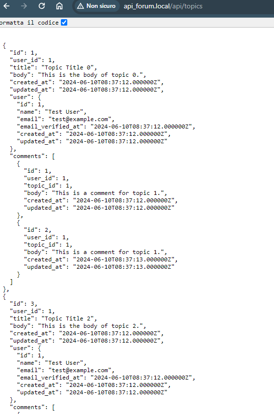
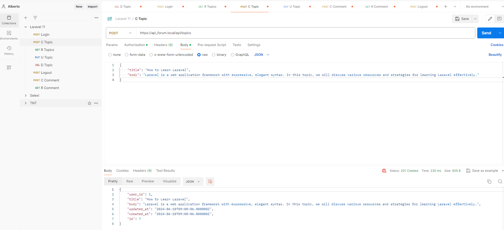

# Laravel API forum

Based on:
- Laravel 11
- MySQL 8

## Technical Requirements

•   PHP 8.2 or higher <br>
•	Composer installed <br>

## Installation

You can install this program by executing the following commands:

```bash
git clone https://github.com/MoroAlberto/api_forum.git
cd api_forum
composer install
cp .env.example .env
php artisan key:generate
php artisan migrate
php artisan db:seed
php artisan serve
```

After this, go to [localhost](https://127.0.0.1:8000/) to update your forum.

## Authentication
By default I create a user:
```bash
username: test@example.com
password: password123
```
but the forum is also accessible by those who do not have a login.

### Login
**POST** - `https://127.0.0.1/api/login`

#### Request Body:
```json
{
    "email": "test@example.com",
    "password": "password123"
}
```

### Logout
**POST** - `https://127.0.0.1/api/logout`

#### Headers:
- Authorization: Bearer Token

## Topics

### Create a New Topic
**POST** - `https://127.0.0.1/api/topics`

#### Headers:
- Authorization: Bearer Token

#### Request Body:
```json
{
    "title": "Topic title",
    "body": "Topic body"
}
```

### Show All Topics
**GET** - `https://127.0.0.1/api/topics`

#### No authentication required

### Update a Topic
**PUT** - `https://127.0.0.1/api/topics/{topic_id}`

#### Headers:
- Authorization: Bearer Token

#### Request Body:
```json
{
    "title": "New Topic title",
    "body": "New Topic body"
}
```

### Delete a Topic
**DELETE** - `https://127.0.0.1/api/topics/{topic_id}`

#### Headers:
- Authorization: Bearer Token

## Comments

### Create a New Comment for a Topic
**POST** - `https://127.0.0.1/api/comments/{topic_id}`

#### Headers:
- Authorization: Bearer Token

#### Request Body:
```json
{
    "body": "Comment Content"
}
```

### Show All Comments
**GET** - `https://127.0.0.1/api/comments`

#### No authentication required

### Show a Single Comment
**GET** - `https://127.0.0.1/api/comments/{comment_id}`

#### No authentication required

### Update a Comment
**PUT** - `https://127.0.0.1/api/comments/{comment_id}`

#### Headers:
- Authorization: Bearer Token

#### Request Body:
```json
{
    "body": "Updated Comment body"
}
```

### Delete a Comment
**DELETE** - `https://127.0.0.1/api/comments/{comment_id}`

#### Headers:
- Authorization: Bearer Token

## Screenshot


